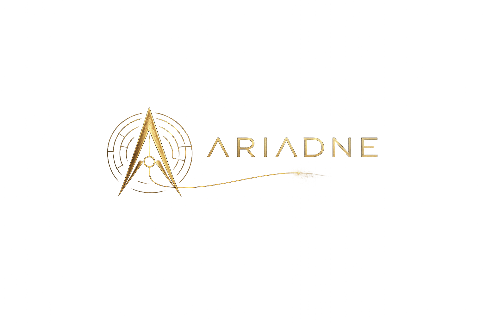
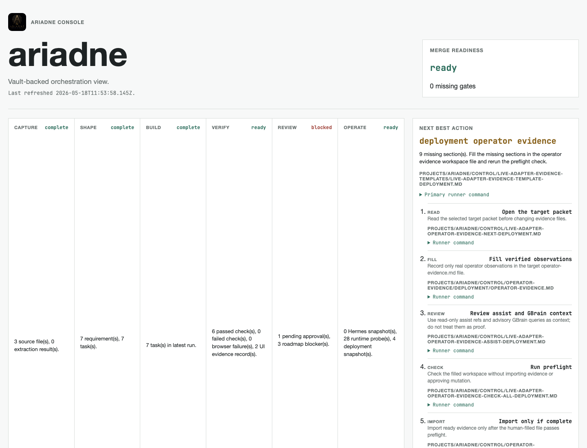
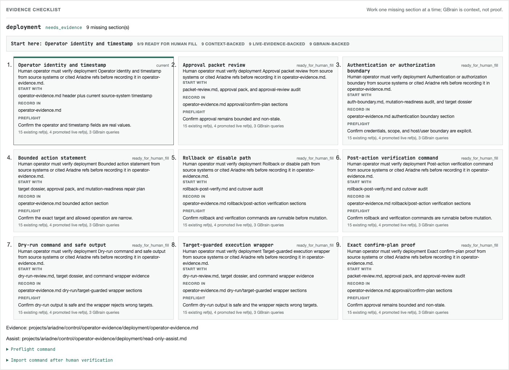

# Ariadne



`ariadne` is an evidence-threaded control layer for agentic software delivery. It helps a developer move from rough source material, such as drawings, white papers, dictated notes, screenshots, NotebookLM exports, and repo context, into a working, tested, reviewable implementation flow.

Ariadne is not another coding assistant. It is the harness around assistants, local models, NotebookLM, GBrain, Hermes, tests, Playwright, CI, review bots, and deployment evidence.

## MVP Install

From the repo root:

```bash
./install.sh
```

That is the one-shot MVP install and local update path. It:

- checks that Node.js 22 or newer is available;
- installs npm dependencies and Playwright Chromium;
- runs type checks, tests, and the TypeScript build;
- refreshes Ariadne's control plane;
- regenerates the static console;
- runs deterministic and browser-backed console checks;
- captures a console screenshot; and
- prints the next operator handoff.

It is safe to run again after pulling updates:

```bash
git pull --ff-only
./install.sh
```

If your shell cannot execute the wrapper, use the npm script directly:

```bash
npm run setup:mvp
```

When it finishes, open:

```text
vault/projects/ariadne/console/index.html
```

or run the printed `open .../console/index.html` command.

## First Screen

Start with the console, not the command reference.



The console is the human cockpit. It shows the current workflow stage, the next best action, evidence status, review gates, runtime state, and operator blockers.

When the system is blocked on human evidence, use the operator checklist:



The checklist tells the operator which real-world fact to verify next and where to record it. Generated notes, GBrain reports, and assist files can help review, but they do not count as operator proof until a human fills the evidence file and the preflight passes.

## Daily Use

The normal loop is intentionally small:

```text
install/update -> open console -> follow Next Best Action -> verify -> refresh console
```

For the current Ariadne project:

```bash
npm run ariadne -- operator-next --project ariadne
```

That command refreshes the current packet and prints the smallest useful handoff: target, evidence file, current section, preflight command, and later import command.

For a one-section handoff:

```bash
npm run ariadne -- operator-section --project ariadne
```

For a workflow explanation without the full command list:

```bash
npm run ariadne -- guide --project ariadne
```

For a current diagnostic summary:

```bash
npm run ariadne -- status --project ariadne
```

Use `status --expert` only when you deliberately want dense runner commands.

## Operating Model

The MVP has four user routes:

| Route | Primary surface | Use it when |
| --- | --- | --- |
| Idea to working system | Ariadne Console | You are turning notes, drawings, research, or dictated ideas into an implementation plan. |
| Implementation slice | Ariadne Console plus `ariadne` runner | You are building one bounded branch with tests, Playwright evidence, review, and merge readiness. |
| Operator evidence gate | Ariadne Console plus evidence packet | Ariadne is blocked until a human verifies real external-system facts. |
| Sleep, memory, automation loop | Hermes plus Ariadne evidence | You are using sleep routines, memory proposals, agent mail, leases, or scheduled refreshes. |

Surface responsibilities:

| Surface | Role |
| --- | --- |
| Ariadne Console | Human cockpit and approval/evidence view. |
| `ariadne` runner | Expert automation surface for generating and checking artifacts. |
| Hermes | Long-running runtime for schedules, sleep, memory, mail, sessions, and coordination. |
| NotebookLM | Source-grounded research input, imported as reviewed files. |
| GBrain | Advisory semantic memory; never approval by itself. |
| GitHub, CI, CodeRabbit, Grok | Review and status evidence. |

## Current MVP Boundary

Working now:

- source intake and preservation;
- dossier, PRD, GSD, execution, Playwright, infrastructure, evaluation, and control artifacts;
- static console and typed `console-data.json`;
- browser-backed console checks and screenshots;
- GBrain export/import evidence hooks;
- Hermes sleep, memory, mail, and cron evidence records;
- local runtime and deployment read-only evidence imports;
- operator handoffs for live-adapter evidence gates; and
- smoke, realistic, and stress benchmark source packs.

Intentionally blocked until human proof exists:

- live mutation of GitHub, Proxmox, TrueNAS, Hermes jobs, runners, GSD, NotebookLM, OpenScorpion, or deployment targets;
- claims that the whole roadmap is complete; and
- importing generated assist text as operator proof.

## Add Source Material

```bash
npm run ariadne -- ingest --project ariadne ./notes.md ./whitepaper.docx
npm run ariadne -- assemble --project ariadne
npm run ariadne -- roadmap-control-refresh --project ariadne
```

NotebookLM exports are imported as files:

```bash
npm run ariadne -- notebooklm-import --project ariadne --from notebooklm-export.md
```

Drawings, screenshots, PDFs, and dictated audio should be extracted or transcribed by a chosen tool first, then imported as reviewed text. See [MVP User Guide](docs/user-guide.md).

## Verify Changes

Before trusting a repo change:

```bash
npm run check
npm test
npm run build
npm run ariadne -- console-visual-checks --project ariadne
npm run ariadne -- console-browser-checks --project ariadne
npm run ariadne -- e2e-smoke --project ariadne
```

`e2e-smoke` can correctly end in `blocked` while operator evidence is missing. For the MVP, the important thing is `0 failed`.

## Documentation

- [MVP User Guide](docs/user-guide.md)
- [Workflow Guide](docs/workflows.md)
- [Developer Guide](docs/developer-guide.md)
- [Command Reference](docs/command-reference.md)
- [Evaluation System](docs/evaluation.md)
- [Deployment Guide](docs/deployment.md)
- [Orchestration Visualisation](docs/orchestration-visualisation.md)
- [Adapter Contracts](docs/adapters.md)
- [Architecture](docs/architecture.md)
- [Roadmap](docs/roadmap.md)
- [Source Contract](docs/source-contract.md)
- [Research Notes](docs/research-notes.md)
- [Brand](docs/brand.md)

## Deployment Intent

Ariadne is designed for a mixed estate:

- Macs for development, local verification, screenshots, and Playwright evidence.
- DGX Spark for high-memory and GPU-heavy model/evaluation workloads.
- Proxmox Linux for always-on orchestration, runners, and read-only infrastructure adapters.
- TrueNAS for durable artifact storage and backup.

See [Deployment](docs/deployment.md) for the staged plan.
